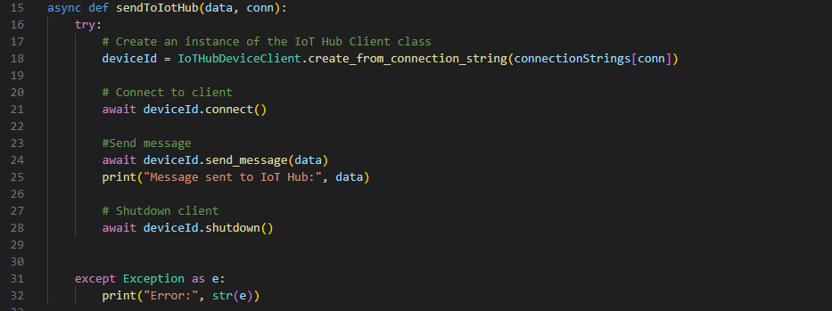
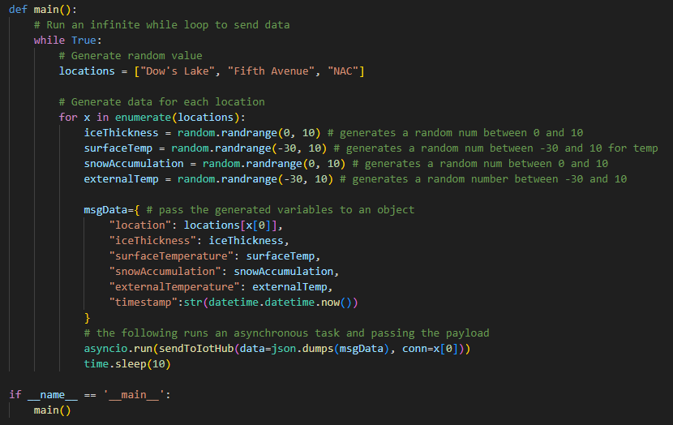
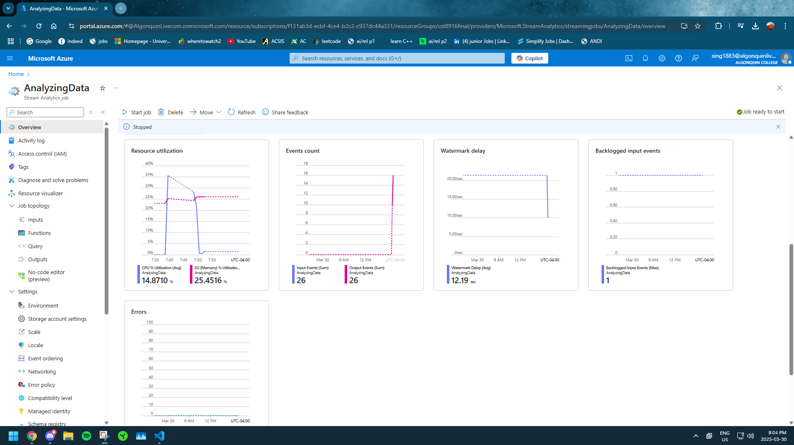
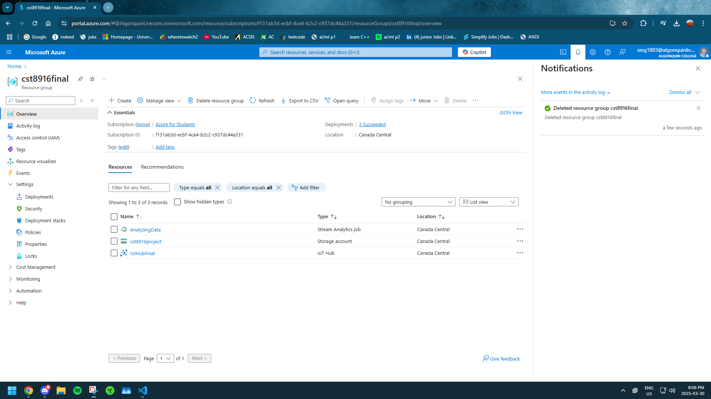

# Final Project Assignment: Real-time Monitoring System for Rideau Canal Skateway

## Scenario Description
The Rideau Canal Skateway in Ottawa that allows the public to skate on its surface throughout the winter season, making it one of Ottawa's largest skating attractions. The issue is that given global warming and the skateway being a canal, the National Capital Commission (NCC) must determine whether the canal is safe enough for the public to skate on or to close the canal for the rest of the winter.

### Problem Solved
This issue can be solved by placing IoT sensors within the canal to measure the following:

* Ice Thickness (in cm) - Ensures the public does not fall into the canal.
* Surface Temperature (in Celsius) - Ice melting risks.
* Snow Accumulation (in cm) - Determines ice structure, meaning if theres too much the public cant skate.
* External Temperature (in Celsius) - Whether it is safe to skate in the canal outside.

The analysis and processing of theses measurements, while visualizing them, will allow NCC to determine the appropriate measures to be taken, the goal being to open the canal without risking public safety. With IoT sensors, information about the canal's condition can be determined in real-time, allowing the NCC to determine specific conditions on when to open the canal. For example, the NCC may open the canal on a day they deem safe and close the canal the next day due to poor conditions.

## System Architecture


The architecture above shows the relationship of the IoT devices along with Azure Cloud services. The IoT devices send their data via a connection string to IoT hub which is then sent to Azure Stream Analytics for processing. When the data is finished processing, it is then sent to Azure Blob storage where it is stored in containers.

## Implementation Details
### IoT Sensor Simulation

This connection part where is uses the .env file for the environment variables. We define our environment variables (connection strings), and how we use the passed data and index (conn) to send the message.



This main method, is a while loop set to true, in the loop is an array of locations and each location in one iteration of the while loop, numbers are generated for our json variables. The json and an index number is sent to the sendToIotHub() function, which handles sending of the data to the endpoints. Each iteration of the inner loop pauses for 10 seconds after sending a message to IoT Hub.

For the sensors, the JSON payload is separated into ice thickness, surface temperature, snow accumulation, and external temperature. We use data=json.dumps(msgData) which returns our object full of generated variables into a json string, while passing it to the sendToIotHub() method. This data is sent with new generated data to alternating locations for as long as the program is running.



### Azure IoT Hub Configuration
IoT Overview:


Creating an IoT hub Devices. This process was repeated two more times to create a total of three devices:

.png)

IoT connection Strings and endpoints are used within the .env file of the IoT simulation code to connect simulated devices to Azure IoT hub. The important connection used is the Primary Connection String. The messages are then routed to the IoT hub.


### Azure Stream Analytics Job
Stream Analytics Overview:

This with a connection string to the storage is how the Stream Analytics service was setup.


The input was created. I picked Messaging as the endpoint and JSON as our input format since the simulation IoT devices output JSON. The source of the input is the IoT hub, so Stream Analytics will retrieve and processes the data in IoT Hub.

.png)

The Output is created. Here it is linked to the storage container and the container was used to store logs of the data. The organization format is in array form as it is much easier to parse the information.

.png)

### Querying Azure Stream Analytics

As a sample query:

```SQL
SELECT * INTO [jsonstorage1] FROM [IoThubs1]
```
This shows us rows full of data of our sensor data.


For the query we used to determine my data was that only 'Unsafe' ice conditions are to be logged and stored into the container.


### Azure Blob Storage

Creating A Storage Account, keeping default setting, enabling access of network and choosing locally redundant storage:


Created blob storage container with default settings:


## Usage Instructions

### Running the IoT Sensor Simulation
These are the steps to run the simulation of the three devices:

1. In the project root folder, create a `.env` file with the following fields:
    * `IOTHUB_STR1`
    * `IOTHUB_STR2`
    * `IOTHUB_STR3`
    * Each field should have the IoT Hub connection string from one of three Created Devices in IoT Hub, for example:
        ```
        IOTHUB_STR1 = "HostName=IoThubs1.azure-devices.net;DeviceId=iotsensor1;SharedAccessKey=<string>"
        ```
2. `pip install -r requirements.txt` to install the requirements (2).
3. `py sensor-simulation/sensor.py` to run the program.

### Configuring Azure Services

#### Creating Azure IoT Hub

Picking free tier for instance details :


Picking public access networking:


Shared Access policy + RBAC:


No defender/updates:


Creating a IoT hub Device. This process is repeated two more times for three devices, one for each region:
.png)

All three IoT devices:
.png)

#### Creating Azure Stream Analytics

Creating a New Stream Analytics Job. We picked '1/3' in streaming units for cost effectiveness:


Connecting Stream Analytics Job to the appropriate storage account 'cst8916project':


I picked 'Messaging' as the endpoint and JSON as our input format since the IoT device simulation outputs JSON:
.png)

Here, the output is created and is linked to the storage container. A more descriptive name could have been used for example 'IceWarningLogs', as later that container was used to store specific data on whether is it safe to skate:
.png)

Results of the Stream output/input creation:


### Accessing Stored Data

After 10 seconds, the Stream Job outputted a JSON file to the container:


## Results

Stream Analytics. Receiving simulated messages:


A json file was downloaded from the container after it was stored, its labled as `Alldatastorage.json`, in the `jsonDatafiles` this confirming that the data has been processed into a JSON array format. Another json file was downloaded to store the average data that is labled as `AverageData.json`, in the `jsonDatafiles` this contains the average data for ice thickness.

After the testing of the IoT devices and the assignment, we deleted our resources:


## Reflection

In this assignment, we explored the development process of setting up a pipeline from an IoT device to the Azure cloud. Initially, we faced challenges using Java due to limited library support and build tool issues, leading us to switch to Python, which proved to be more efficient, lightweight, and better supported. Navigating the Azure Portal also presented difficulties due to its complexity and specific service requirements. Ultimately, with the help of step-by-step resources, we successfully ran a batch job to process sensor data and gained valuable insights into language choice, tooling, and Azure service configuration.


